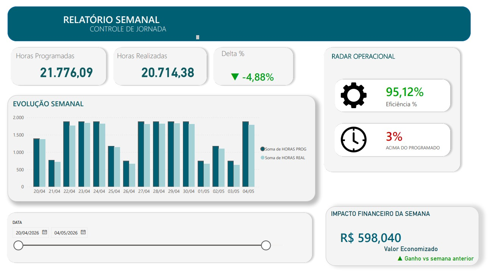

# 📊 Dashboard de Controle de Jornada

Projeto desenvolvido para transformar dados operacionais de jornada de motoristas em informações estratégicas para tomada de decisão.

O objetivo foi centralizar indicadores de horas programadas x realizadas, eficiência operacional, desvios de jornada e impacto financeiro em um único painel visual.

# Dashboard

# Problema

Na operação de transporte público existe a necessidade de acompanhar diariamente a execução das jornadas dos motoristas, identificando:
- Horas realizadas acima ou abaixo do planejado.
- Eficiência operacional.
- Desvios do programado.
- Impacto financeiro gerado.
- Evolução dos indicadores ao longo do tempo.

Sem uma visualização centralizada, a análise exige consultas manuais e pode atrasar tomadas de decisão.

# Solução desenvolvida
Foi criado um dashboard interativo para monitoramento semanal da operação, permitindo:

✔ Comparar horas programadas x realizadas
✔ Identificar variações percentuais
✔ Monitorar eficiência operacional
✔ Acompanhar tendências semanais
✔ Medir impactos financeiros
✔ Filtrar períodos específicos

# Tecnologias utilizadas

- Power BI
- Excel
- DAX
- Modelagem de dados
- Storytelling de dados

# Principais aprendizados
Durante o desenvolvimento deste projeto pratiquei:

- Construção de KPIs operacionais
- Criação de medidas em DAX
- Estruturação visual para tomada de decisão
- Aplicação de conceitos de UX em dashboards
- Transformação de dados em insights
